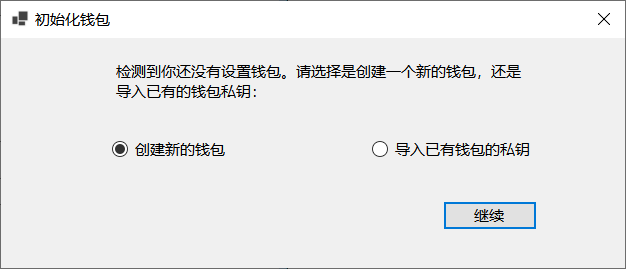

# NFTIT! - 万物皆可NFT

NFTIT!是一款Windows下的以太坊NFT制作工具，可以快速完成艺术品NFT的上链发布。

NFTIT!的主要特点如下：

- 无需安装，下载解压即可使用
- 内置钱包管理，支持新建钱包或导入已有钱包
- 支持右键菜单操作，选中作品即可直接制作NFT：

## 1、钱包初始化

第一次启动NFTIT!，会提示初始化与以太坊交互的钱包：

有两个可选项，选择其中之一进行初始化即可：

- 创建新钱包：选择该选项时，NFTIT!将为你创建一个新的随机钱包
- 导入已有钱包的私钥，选择该选项时，NFTIT!将导入之前已有的钱包私钥

__选项1：创建新钱包__

如果选择创建新钱包，然后点击【继续】，将提示新钱包创建成功：

点击【确定】后即可进入NFTIT!的主界面：

__选项2：导入已有钱包的私钥__

如果选择导入已有钱包的私钥，则点击【继续】后，将弹出导入私钥对话框：

将64个字符长的私钥填入后，点击【导入】，将提示钱包导入成功：

点击【确定】后即可进入NFTIT!的主界面：

## 2、上传作品

点击【上传作品】按钮，在弹出的对话框中选择要上传的作品：

选好后，点击【打开】按钮，即可返回程序主界面：

## 3、填写作品信息

在主界面右侧填写作品名称、说明、扩展链接（比如作品的网址）等信息：

## 4、制作NFT

在点击【制作NFT】按钮之前请首先检查账号余额，确保钱包余额不低于0.05 ETH：

点击【制作NFT】按钮，可以看到状态提示信息：

作品成功上链后，将显示NFT的编号信息，同时【查看NFT】按钮可用：

## 5、查看NFT

点击【查看NFT】按钮，将在系统浏览器中打开NFT在Rarible市场的展示网址：

注意这时Rarible市场还未同步作品元数据，点击【Refresh metadata】按钮进行同步，
稍后可以看到作品的信息：

 

